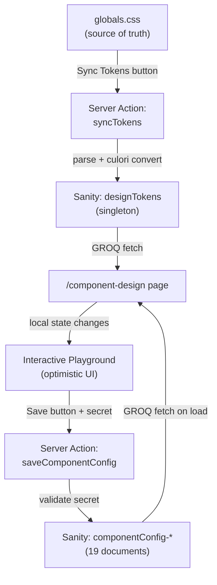

# Component Design System — Interactive Playgrounds with Sanity Persistence

## Architecture Overview



## Phase 1: Sanity Schemas and Write Infrastructure

### 1A. Write Client

Create `[src/sanity/lib/writeClient.ts](src/sanity/lib/writeClient.ts)` — a Sanity client with write permissions using a new env var `SANITY_API_WRITE_TOKEN` (reuse the existing `SANITY_DEVELOPER_TOKEN` pattern or create a dedicated one).

```typescript
import { createClient } from 'next-sanity'
import { apiVersion, dataset, projectId } from '../env'

export const writeClient = createClient({
  projectId,
  dataset,
  apiVersion,
  useCdn: false,
  token: process.env.SANITY_API_WRITE_TOKEN,
})
```

### 1B. `designTokens` Schema (Singleton)

Create `[src/sanity/schemaTypes/designTokens.ts](src/sanity/schemaTypes/designTokens.ts)`

- `_type: 'designTokens'`, `_id: 'designTokens'`
- `lastSyncedAt` (datetime)
- `palettes[]` — array of objects, each with:
  - `paletteName` (string, e.g. `fcu-primary`)
  - `tokens[]` — array of:
    - `name` (string, e.g. `fcu-primary-900`)
    - `cssVariable` (string, e.g. `--color-fcu-primary-900`)
    - `oklch` (string, raw OKLCH value from CSS)
    - `hex` (string, computed by culori)
    - `rgb` (string, computed by culori)

### 1C. `componentConfig` Schema (Per-Component Documents)

Create `[src/sanity/schemaTypes/componentConfig.ts](src/sanity/schemaTypes/componentConfig.ts)`

Each document (`_id: 'componentConfig-button'`, etc.) stores:

- `componentName` (slug, read-only) — e.g. `button`
- `displayName` (string) — e.g. `Button`
- `category` (string) — `actions` | `forms` | `layout` | `overlay` | `navigation` | `data`
- `approvedVariants[]` (array of strings) — subset of available variants
- `disabledVariants[]` (array of strings) — explicitly excluded
- `approvedSizes[]` (array of strings) — subset of available sizes
- `defaultVariant` (string)
- `defaultSize` (string)
- `variantGuidelines[]` — array of objects:
  - `variant` (string)
  - `colorToken` (string, references a designTokens token name)
  - `usageNote` (text)
- `componentSpecificConfig` (object) — varies per component type:
  - Button: `defaultLabel` (string), `defaultDisabled` (boolean)
  - Accordion: `defaultType` (single/multiple), `defaultCollapsible` (boolean)
  - Sheet: `defaultSide` (top/right/bottom/left)
  - Tabs: `defaultOrientation` (horizontal/vertical), `defaultListVariant` (default/line)
  - etc.
- `previewConfig` (object) — current playground state for persistence

### 1D. Register Schemas and Update Studio Structure

Update `[src/sanity/schemaTypes/index.ts](src/sanity/schemaTypes/index.ts)` — add `designTokens` and `componentConfig`.

Update `[src/sanity/structure.ts](src/sanity/structure.ts)` — add a "Design System" section in the Studio sidebar with:

- Design Tokens (singleton)
- Component Configs (list of 19 documents)

### 1E. GROQ Queries

Add to `[src/sanity/lib/queries.ts](src/sanity/lib/queries.ts)`:

- `DESIGN_TOKENS_QUERY` — fetch the singleton
- `ALL_COMPONENT_CONFIGS_QUERY` — fetch all 19 configs
- `COMPONENT_CONFIG_QUERY` — fetch a single config by componentName

---

## Phase 2: Server Actions

### 2A. Authentication Setup

**Approach:** Environment variable shared secret (simplest, zero infrastructure).

- New env var: `COMPONENT_DESIGN_SECRET` — a random string set in `.env.local`
- The `/component-design` page prompts for the secret on first visit, stores in `localStorage`
- Every Server Action receives the secret and validates it before writing

Create `[src/app/(frontend)/component-design/_actions/auth.ts](<src/app/(frontend)`/component-design/actions/auth.ts>):

```typescript
'use server'
export async function validateSecret(secret: string): Promise<boolean> {
  return secret === process.env.COMPONENT_DESIGN_SECRET
}
```

### 2B. Sync Tokens Action

Create `[src/app/(frontend)/component-design/_actions/sync-tokens.ts](<src/app/(frontend)`/component-design/actions/sync-tokens.ts>):

1. Read `globals.css` from filesystem using `fs.readFile`
2. Parse the `@theme inline` block with regex to extract all `--color-fcu-*` variables and their OKLCH values
3. Group by palette name (e.g. all `--color-fcu-primary-*` into `fcu-primary`)
4. Convert each OKLCH value to hex and RGB using `culori`
5. Write the `designTokens` singleton to Sanity via `writeClient`

### 2C. Save Component Config Action

Create `[src/app/(frontend)/component-design/_actions/save-component-config.ts](<src/app/(frontend)`/component-design/actions/save-component-config.ts>):

1. Validate the shared secret
2. Receive the component config payload
3. Write to Sanity via `writeClient.createOrReplace()`
4. Return success/error

---

## Phase 3: Frontend — Component Playgrounds

### 3A. Update Sidebar TOC

Update `[src/app/(frontend)/component-design/_components/component-design-layout.tsx](<src/app/(frontend)`/component-design/components/component-design-layout.tsx>):

Add a **"UI Primitives"** group between "Components" and "Reference" with all 19 entries:

- Components (existing 6 page-builder categories)
- UI Primitives (19 Shadcn components):
  - Button, Badge, Input, Select, Switch, Slider, Label, Card, Separator, Tabs, Accordion, Table, Dialog, Sheet, Tooltip, Toast, Navigation Menu, Command, Scroll Area
- Reference (Architecture Research)

### 3B. Auth Gate Component

Create `[src/app/(frontend)/component-design/_components/auth-gate.tsx](<src/app/(frontend)`/component-design/components/auth-gate.tsx>):

A client component that:

- Checks `localStorage` for saved secret
- If missing, shows a simple PIN/password input dialog
- Validates via the `validateSecret` Server Action
- On success, stores in `localStorage` and renders children
- Provides the secret to child components via React Context

### 3C. Shared Playground Shell

Create `[src/app/(frontend)/component-design/_components/playground-shell.tsx](<src/app/(frontend)`/component-design/components/playground-shell.tsx>):

A reusable wrapper for every component playground:

- Section header (component name, description, category badge)
- Split layout: **Preview** (left/top) + **Controls** (right/bottom)
- "Save Configuration" button with loading/success/error states
- "Unsaved changes" indicator
- Approved/disabled variant badges
- Usage guidelines display (from Sanity)

### 3D. Individual Component Showcases (19 files)

Create one file per component in `src/app/(frontend)/component-design/_components/showcases/`:

Each showcase component:

- Receives its `componentConfig` from Sanity as a prop
- Renders the actual Shadcn component with live-togglable props
- Uses the PlaygroundShell for consistent layout
- Manages local state for unsaved changes

**Tier 1 (variant-rich, most interactive):**

- `button-showcase.tsx` — variant picker, size picker, disabled toggle, icon toggle, label input
- `badge-showcase.tsx` — variant picker, label input
- `tabs-showcase.tsx` — list variant picker, orientation toggle

**Tier 2 (config props):**

- `select-showcase.tsx` — size picker, position toggle
- `switch-showcase.tsx` — size picker, checked/disabled toggles
- `sheet-showcase.tsx` — side picker, showCloseButton toggle
- `dialog-showcase.tsx` — showCloseButton toggles
- `separator-showcase.tsx` — orientation toggle
- `navigation-menu-showcase.tsx` — viewport toggle
- `tooltip-showcase.tsx` — side picker, offset slider
- `scroll-area-showcase.tsx` — orientation toggle

**Tier 3 (compositional):**

- `input-showcase.tsx` — type selector, placeholder input, disabled toggle
- `slider-showcase.tsx` — min/max/step inputs, orientation toggle
- `accordion-showcase.tsx` — type toggle (single/multiple), collapsible toggle
- `label-showcase.tsx` — text input, disabled toggle
- `card-showcase.tsx` — show/hide sub-components toggles
- `table-showcase.tsx` — row count, caption toggle
- `command-showcase.tsx` — demo with search and groups
- `sonner-showcase.tsx` — toast type buttons (success, error, warning, info)

### 3E. Sync Tokens UI

Create `[src/app/(frontend)/component-design/_components/sync-tokens-button.tsx](<src/app/(frontend)`/component-design/components/sync-tokens-button.tsx>):

A button (placed in the page header or sidebar) that:

- Calls the `syncTokens` Server Action
- Shows loading/success/error states
- Displays last synced timestamp from Sanity

### 3F. Update Page

Update `[src/app/(frontend)/component-design/page.tsx](<src/app/(frontend)`/component-design/page.tsx>):

- Fetch `designTokens` and all `componentConfig` documents via `sanityFetch`
- Wrap everything in `AuthGate`
- Render all 19 showcase components with their configs
- Keep the 6 page-builder placeholder sections
- Keep Architecture Research at the bottom

---

## Phase 4: Seed Initial Component Configs

Create `[scripts/seed-component-configs.ts](scripts/seed-component-configs.ts)`:

A script that creates all 19 `componentConfig` documents with sensible FCU defaults:

- Button: approved variants = `default`, `outline`, `secondary`, `ghost`, `link` (exclude `destructive`); default = `default` / `default`
- Badge: approved variants = `default`, `secondary`, `outline`
- etc.

Run once to populate Sanity with initial data.

---

## File Summary

**New files (approximately 30):**

- 3 Sanity schema files
- 1 write client
- 3 Server Action files
- 1 auth gate component
- 1 playground shell component
- 19 showcase components
- 1 sync tokens button
- 1 seed script

**Modified files (4):**

- `src/sanity/schemaTypes/index.ts`
- `src/sanity/structure.ts`
- `src/sanity/lib/queries.ts`
- `src/app/(frontend)/component-design/page.tsx`
- `src/app/(frontend)/component-design/_components/component-design-layout.tsx`

---

## Implementation Order

The plan should be executed in this order due to dependencies:

1. Phase 1 (Sanity schemas + write client) — everything else depends on this
2. Phase 2A (auth) — needed before any Server Actions work
3. Phase 2B + 2C (Server Actions) — needed before frontend can save
4. Phase 3A + 3B (sidebar update + auth gate) — structural changes
5. Phase 3C (playground shell) — shared component all showcases use
6. Phase 3D (19 showcases) — the bulk of the work, can be done in batches:

- Batch 1: Button, Badge, Input (most common, prove the pattern)
- Batch 2: Select, Switch, Slider, Label (form controls)
- Batch 3: Tabs, Accordion, Card, Table (layout/data)
- Batch 4: Dialog, Sheet, Tooltip, Sonner (overlays)
- Batch 5: NavigationMenu, Command, ScrollArea, Separator (remaining)

1. Phase 3E + 3F (sync tokens + page wiring)
2. Phase 4 (seed script)
