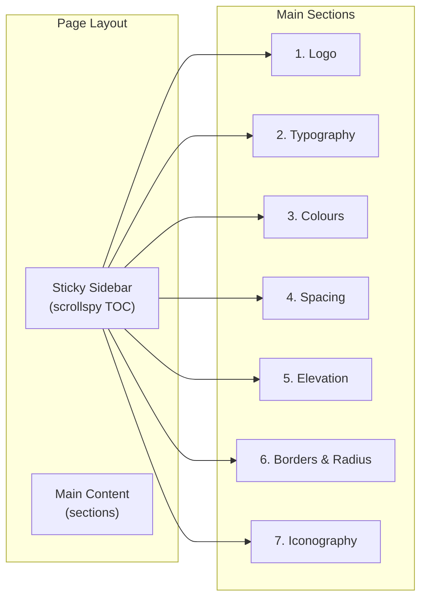

# FCU Design Guidelines Page

## Architecture

Single route at `src/app/(frontend)/design-guidelines/page.tsx` with:

- A **sticky sidebar** (left) with scrollspy-driven table of contents that highlights the current section as you scroll
- A **main content area** (right) with all sections stacked vertically, each identified by an `id` for anchor linking
- **Live interactive demos** using client components for toggling variants, sizes, states



## File Structure

```
src/app/(frontend)/design-guidelines/
  page.tsx                          # Server component, imports all sections
  _components/
    design-guidelines-layout.tsx    # Client: sidebar + scrollspy + main wrapper
    section-wrapper.tsx             # Reusable section container with id + title
    code-block.tsx                  # Code snippet display with copy button
    colour-swatch.tsx               # Interactive colour swatch card
    spacing-visualizer.tsx          # Spacing scale visualization
    shadow-showcase.tsx             # Elevation level cards
    radius-showcase.tsx             # Border radius preview
    typography-specimen.tsx         # Type scale specimen rows
    icon-grid.tsx                   # Icon library grid display
    interactive-demo.tsx            # Generic wrapper for live demos with state toggles
```

## Key Implementation Details

### Sticky Sidebar with Scrollspy

- Uses `IntersectionObserver` to detect which section is in view
- Highlights active section in the sidebar
- Smooth scroll on click via `scrollIntoView({ behavior: 'smooth' })`
- Collapses to a horizontal top nav or hamburger on mobile

### Design Aesthetic

Following the project's existing conventions:

- **FCU Primary blue** for headings, active states, sidebar highlights
- **FCU Secondary green** for accent details, interactive hover states
- **Poppins** for all text (already the project font)
- Clean, documentation-style layout with generous whitespace
- Subtle `motion` animations on section entry (fade + slide up)
- Light background with card-based content groupings

### Sections to Build (Phase 1: Foundations)

**1. Logo** — Display `fcu-logo.png` from `/public`. Show clear space rules, minimum sizes, background do's/don'ts (rendered as visual cards). Note: only the primary PNG logo is available; other variants (reversed, monochrome) will be marked as placeholders.

**2. Typography** — Interactive type specimen showing:

- All 9 Poppins weights with live text preview
- Full type scale (Display through Helper) with size/weight/line-height/letter-spacing
- Editable text input so the team can type custom text and see it in all scales
- Responsive behaviour notes

**3. Colours** — Interactive colour palette:

- FCU Primary (50-950) and Secondary (50-950) as clickable swatches that copy the token name/OKLCH value on click
- Semantic colours from `:root` (background, foreground, primary, destructive, etc.)
- Status colours (success, warning, error, info)
- Live contrast checker: pick any two colours and see the WCAG AA/AAA ratio

**4. Spacing** — Visual scale:

- Render each spacing step as a coloured bar with the pixel/rem value and Tailwind class
- Interactive: hover to highlight, click to copy class name

**5. Elevation & Shadows** — Shadow level cards:

- Show each elevation level (0-5) as a card that demonstrates the shadow
- Interactive hover to preview the next level up
- Show the CSS values alongside

**6. Borders & Radius** — Radius scale:

- Render each radius token as a box with that radius applied
- Show the CSS variable and computed pixel value
- Interactive slider to preview custom radius values

**7. Iconography** — Icon grid:

- Display all commonly used Lucide icons in a searchable grid
- Show different sizes (16, 20, 24, 32, 48)
- Click to copy import statement

### shadcn Components to Install

We need a few more shadcn components for the interactive demos:

- `tabs` — for code/preview toggles
- `separator` — section dividers
- `badge` — status labels
- `tooltip` — hover info on swatches
- `input` — search and editable text
- `scroll-area` — sidebar scroll
- `card` — content grouping
- `table` — token reference tables
- `select` — variant pickers
- `switch` — toggle demos
- `slider` — radius/spacing interactive controls
- `label` — form labels
- `separator` — visual dividers
- `toast` / `sonner` — "Copied!" feedback

### Dependencies

- `sonner` — toast notifications for copy-to-clipboard feedback (lightweight, already compatible with shadcn)

### Performance Considerations

- Page is mostly client-side (interactive demos) but the outer `page.tsx` is a server component that imports the client layout
- Use `dynamic(() => import(...), { ssr: false })` for heavy sections like the icon grid to avoid bloating initial load
- Lazy-load sections below the fold using intersection observer

## Phase 2 (Future)

After foundations are complete, we add:

- Components section (Button, Input, Accordion, Dialog, Sheet, etc. with live variant toggles)
- Motion & Animation section (with live playback demos)
- Voice & Tone section
- Accessibility guidelines section
- Dark mode toggle to preview everything in dark theme
- Patterns & Templates section
