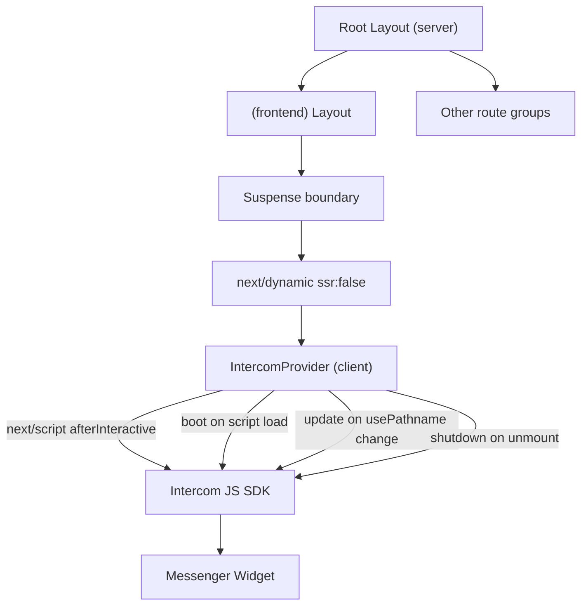

# Intercom Phase 1 — Messenger Widget Integration

## Context

- `NEXT_PUBLIC_INTERCOM_APP_ID` is now set in `.env.local`
- No `src/types/` directory exists yet — it will be created
- Components live in `src/components/` (flat, no subdirectories)
- The app has two layout levels:
  - [src/app/layout.tsx](src/app/layout.tsx) — root layout (Server Component, wraps everything including Sanity Studio routes)
  - [src/app/(frontend)/layout.tsx](<src/app/(frontend)/layout.tsx>) — frontend layout (wraps only public-facing pages)
- Intercom should load only on frontend pages, not inside Sanity Studio or internal tool routes

## Best Practices Applied

Reviewed against `vercel-react-best-practices` and `next-best-practices` skills. Three rules shaped the implementation:

- `**bundle-defer-third-party**` — Intercom is non-critical. Use `next/dynamic` with `ssr: false` to defer loading until after hydration, keeping it out of the initial bundle.
- `**next/script` over raw `<script>` injection — Use `next/script` with `strategy="afterInteractive"` to load the Intercom SDK. This gives Next.js control over script scheduling and avoids hydration issues from DOM-mutating third-party scripts.
- **Suspense boundary for `usePathname()`** — The provider uses `usePathname()` to detect route changes. On dynamic routes this can trigger CSR bailout, so the provider must be wrapped in `<Suspense>` in the layout.

## Architecture



## Changes

### 1. Create `src/types/intercom.d.ts` (new file)

TypeScript declarations for the `window.Intercom` and `window.intercomSettings` globals. This gives type safety to all Intercom SDK calls without installing a third-party types package.

Key types to declare:

- `IntercomCommand` — union of valid command strings (`boot`, `shutdown`, `update`, `hide`, `show`, `showNewMessage`, `trackEvent`, etc.)
- `IntercomSettings` — the settings object passed to `boot` and `update` (app_id, user_id, name, email, user_hash, custom attributes)
- Augment the global `Window` interface

### 2. Create `src/components/intercom-provider.tsx` (new file)

A `'use client'` component that:

- Reads `NEXT_PUBLIC_INTERCOM_APP_ID` from the environment
- Uses `next/script` with `strategy="afterInteractive"` to load the Intercom widget script (not raw DOM script injection)
- On script load callback: calls `Intercom('boot', { app_id })`
- On route change: calls `Intercom('update')` using `usePathname()` in a `useEffect`
- On unmount: calls `Intercom('shutdown')` to clean up
- Renders only the `<Script>` tag (no visible UI)
- Gracefully no-ops if the app ID env var is missing (so the app doesn't break in environments without it)

### 3. Edit [src/app/(frontend)/layout.tsx](<src/app/(frontend)/layout.tsx>) (existing file)

Import the provider via `next/dynamic` with `ssr: false` (per `bundle-defer-third-party`) and wrap it in `<Suspense>` (per `suspense-boundaries` guidance for `usePathname()`):

```tsx
import dynamic from 'next/dynamic'
import { Suspense } from 'react'

const IntercomProvider = dynamic(
  () => import('@/components/intercom-provider').then((m) => m.IntercomProvider),
  { ssr: false }
)

// Inside the return, after <SanityLive />:
<Suspense fallback={null}>
  <IntercomProvider />
</Suspense>
```

## Files touched

| File                                   | Action                        |
| -------------------------------------- | ----------------------------- |
| `src/types/intercom.d.ts`              | Create                        |
| `src/components/intercom-provider.tsx` | Create                        |
| `src/app/(frontend)/layout.tsx`        | Edit (add import + component) |

## What this does NOT include

- User identity (Clerk integration) — that's Phase 2
- HMAC identity verification — Phase 2
- Help Center content — Phase 3
- Messenger branding / customisation — Phase 4
- Custom event tracking — Phase 5
