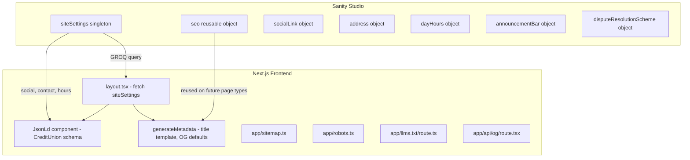
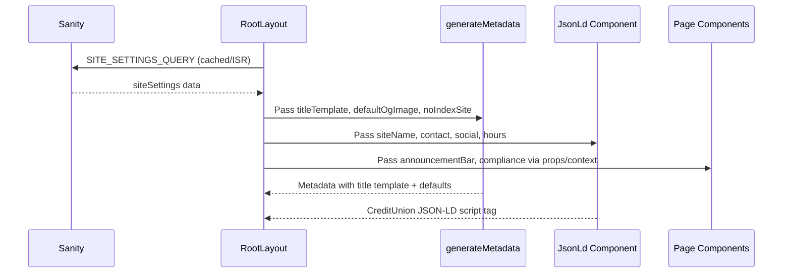

# Site Settings Implementation Plan

## Architecture Overview



## Data Flow: Site Settings to Frontend



---

## Phase 1: Sanity Schema (7 new files)

### 1a. Reusable SEO Object Type

Create `src/sanity/schemaTypes/objects/seo.ts` — a reusable object type (per Sanity SEO best practices) with:

- `title` (string) — overrides page title
- `description` (text, 3 rows) — max 160 chars with warning validation
- `image` (image, hotspot) — 1200x630 recommended
- `noIndex` (boolean, default false)

This object will be reused on every future document type (pages, posts, products) via `defineField({ name: 'seo', type: 'seo' })`.

### 1b. Supporting Object Types

Create these reusable objects in `src/sanity/schemaTypes/objects/`:

- `**socialLink.ts**` — `platform` (string options list), `url` (url), `label` (string). Icon: `LinkIcon`.
- `**address.ts**` — `street`, `suburb`, `city`, `postcode`, `region`, `country` (default "New Zealand"). Icon: `PinIcon`.
- `**dayHours.ts**` — `day` (options list Mon-Sun + Public Holidays), `openTime` (string), `closeTime` (string), `isClosed` (boolean). Icon: `ClockIcon`.
- `**announcementBar.ts**` — `enabled`, `message` (text, max 200), `linkText`, `linkUrl`, `style` (info/warning/success/emergency), `dismissible`, `showOnPages` (all/homepage-only), `startDate`, `endDate`. Icon: `BellIcon`.
- `**disputeResolutionScheme.ts**` — `schemeName`, `schemeUrl`, `memberNumber`, `description`. Icon: `DocumentTextIcon`.

All use `defineType`, `defineField`, `defineArrayMember` per the `sanity-schema` rule.

### 1c. Site Settings Document

Create `src/sanity/schemaTypes/siteSettings.ts` — singleton document with **9 groups** (tabs):

| Group               | Key Fields                                                                                                                                                                                                                          |
| ------------------- | ----------------------------------------------------------------------------------------------------------------------------------------------------------------------------------------------------------------------------------- |
| `general` (default) | siteName, siteTagline, siteDescription, siteUrl, logo, logoAlt, logoDark, favicon, appleTouchIcon, locale, currency, dateFormat, timezone                                                                                           |
| `seo`               | defaultSeoTitle, titleTemplate, defaultSeoDescription, defaultOgImage, twitterHandle, twitterCardType, googleSiteVerification, bingSiteVerification, noIndexSite, robotsTxtOverride, enableJsonLd                                   |
| `social`            | socialLinks (array of socialLink)                                                                                                                                                                                                   |
| `contact`           | primaryPhone, tollFreePhone, primaryEmail, headOfficeAddress, postalAddress, businessHours (array of dayHours), holidayNotice                                                                                                       |
| `announcement`      | announcementBar (object)                                                                                                                                                                                                            |
| `analytics`         | googleAnalyticsId, googleTagManagerId, enableAnalytics, hotjarId, metaPixelId, linkedinPartnerId, customHeadScripts, customBodyScripts                                                                                              |
| `compliance`        | registeredName, nzbn, fspNumber, disputeResolutionScheme, regulatoryBody, copyrightNotice, privacyPolicyUrl, termsUrl, disclosureStatementUrl, complaintsUrl, accessibilityStatementUrl, cookieConsentEnabled, cookieConsentMessage |
| `appearance`        | enableDarkMode, headerStyle, footerStyle, customCss, fontPrimary, fontSecondary                                                                                                                                                     |
| `advanced`          | maintenanceMode, maintenanceMessage, maintenanceAllowedIPs, custom404Title, custom404Description, custom500Title, custom500Description, enablePwa, pwaShortName, pwaThemeColor, pwaBackgroundColor                                  |

Script injection fields (`customHeadScripts`, `customBodyScripts`, `customCss`) will include `description` warnings about security.

### 1d. Register Schemas

Update [src/sanity/schemaTypes/index.ts](src/sanity/schemaTypes/index.ts):

- Import and register `siteSettings` document + all new objects (`seo`, `socialLink`, `address`, `dayHours`, `announcementBar`, `disputeResolutionScheme`)

### 1e. Update Studio Structure

Update [src/sanity/structure.ts](src/sanity/structure.ts):

- Add `'siteSettings'` to the `SINGLETONS` array
- Add a `Site Settings` list item with `CogIcon` at the **top** of the structure (before Navigation), using `S.document().schemaType('siteSettings').documentId('siteSettings')`

---

## Phase 2: GROQ Queries + TypeGen

### 2a. GROQ Query

Add `SITE_SETTINGS_QUERY` to [src/sanity/lib/queries.ts](src/sanity/lib/queries.ts):

```groq
*[_id == "siteSettings"][0] {
  siteName,
  siteTagline,
  siteDescription,
  siteUrl,
  logo,
  logoAlt,
  titleTemplate,
  defaultSeoDescription,
  defaultOgImage,
  twitterHandle,
  twitterCardType,
  googleSiteVerification,
  noIndexSite,
  enableJsonLd,
  enableAnalytics,
  googleAnalyticsId,
  googleTagManagerId,
  socialLinks[] { _key, platform, url, label },
  primaryPhone,
  primaryEmail,
  headOfficeAddress,
  businessHours[] { _key, day, openTime, closeTime, isClosed },
  announcementBar,
  registeredName,
  fspNumber,
  copyrightNotice,
  disputeResolutionScheme,
  cookieConsentEnabled,
  maintenanceMode
}
```

### 2b. Run TypeGen

Run `npx sanity@latest typegen generate` to generate TypeScript types from the new schemas and queries.

---

## Phase 3: Next.js Frontend Integration

### 3a. Root Layout Metadata

Update the root `layout.tsx` to:

- Fetch `SITE_SETTINGS_QUERY` using `sanityFetch` with `stega: false` (critical for SEO — no stega in metadata)
- Use `generateMetadata` to set:
  - `title.template` from `siteSettings.titleTemplate` (e.g. `"%s | First Credit Union"`)
  - `title.default` from `siteSettings.siteName`
  - `description` from `siteSettings.defaultSeoDescription`
  - `openGraph.images` from `siteSettings.defaultOgImage`
  - `twitter.card` and `twitter.site` from settings
  - `robots: 'noindex'` when `noIndexSite` is true
  - `verification.google` from `googleSiteVerification`

### 3b. JSON-LD Component

Create `src/lib/json-ld.tsx`:

- Type-safe `JsonLd` component using `schema-dts` package
- `generateOrganizationSchema()` function that maps siteSettings fields to `CreditUnion` schema.org type (a subtype of `Organization`):
  - `name`, `url`, `logo`, `telephone`, `email`, `address` (PostalAddress), `sameAs` (from socialLinks), `openingHoursSpecification` (from businessHours)
- Render in root layout when `enableJsonLd` is true

### 3c. Dynamic Sitemap

Create `src/app/sitemap.ts`:

- Fetch all indexable content types from Sanity with `seo.noIndex != true`
- Use `NEXT_PUBLIC_SITE_URL` as the base URL
- Map to `MetadataRoute.Sitemap` format

### 3d. Robots.txt

Create `src/app/robots.ts`:

- Fetch `siteSettings.robotsTxtOverride` — if set, use it as-is
- Otherwise, auto-generate with:
  - Allow all standard crawlers
  - Disallow `/api/`, `/studio/`
  - Explicitly allow AI crawlers (GPTBot, ChatGPT-User, PerplexityBot, ClaudeBot, Google-Extended, etc.) per the AI search optimization skill
  - Include `Sitemap:` reference

### 3e. llms.txt Endpoint

Create `src/app/llms.txt/route.ts`:

- Generate a Markdown-formatted LLM site index per the `llms.txt` standard
- Include site name, description, and key page sections from the sitemap
- Return as `text/plain` with 1-hour cache

### 3f. Dynamic OG Image Route (Stub)

Create `src/app/api/og/route.tsx`:

- Edge runtime OG image generator using FCU branding (primary-900 background, white text, logo)
- Accepts `?title=` and `?id=` params
- Falls back when pages have no custom OG image

---

## Phase 4: Seed Initial Data

Create a `scripts/seed-site-settings.mjs` script that uses the Sanity client with `SANITY_DEVELOPER_TOKEN` to create and publish the `siteSettings` document with FCU-specific initial values:

- siteName: "First Credit Union"
- siteUrl: value from `NEXT_PUBLIC_SITE_URL`
- titleTemplate: "%s | First Credit Union"
- locale: "en-NZ"
- currency: "NZD"
- enableJsonLd: true
- enableAnalytics: false (not yet configured)
- noIndexSite: true (site is under development)
- copyrightNotice: "Copyright {year} First Credit Union. All rights reserved."

---

## Phase 5: Install Dependencies

- `schema-dts` — type-safe JSON-LD structured data

---

## Key Files Modified

- [src/sanity/schemaTypes/index.ts](src/sanity/schemaTypes/index.ts) — register new schemas
- [src/sanity/structure.ts](src/sanity/structure.ts) — add Site Settings singleton
- [src/sanity/lib/queries.ts](src/sanity/lib/queries.ts) — add SITE_SETTINGS_QUERY
- Root `layout.tsx` — fetch settings, metadata, JSON-LD

## Key Files Created

- `src/sanity/schemaTypes/siteSettings.ts` — main document schema
- `src/sanity/schemaTypes/objects/seo.ts` — reusable SEO object
- `src/sanity/schemaTypes/objects/socialLink.ts`
- `src/sanity/schemaTypes/objects/address.ts`
- `src/sanity/schemaTypes/objects/dayHours.ts`
- `src/sanity/schemaTypes/objects/announcementBar.ts`
- `src/sanity/schemaTypes/objects/disputeResolutionScheme.ts`
- `src/lib/json-ld.tsx` — JSON-LD component + schema generators
- `src/app/sitemap.ts`
- `src/app/robots.ts`
- `src/app/llms.txt/route.ts`
- `src/app/api/og/route.tsx`
- `scripts/seed-site-settings.mjs`

## What Stays Out of Scope

- Brand colors remain in `globals.css` (already configured)
- API keys remain in `.env.local`
- Font files managed by `next/font`
- Redirect document type (separate future task)
- Cookie consent UI component (future task, schema field is ready)
- Announcement bar UI component (future task, schema field is ready)
- Maintenance mode middleware (future task, schema field is ready)
